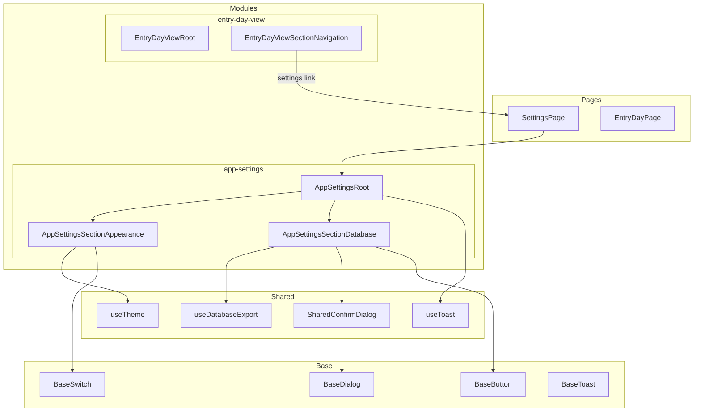
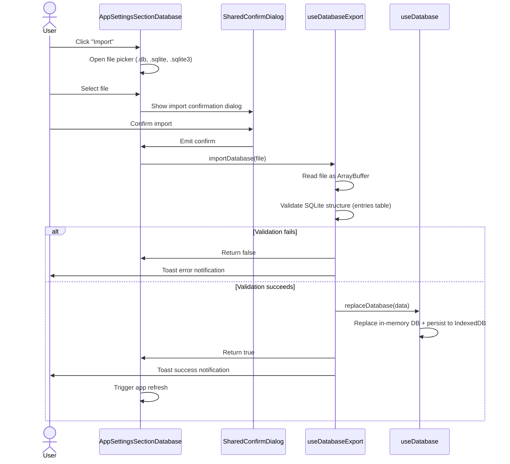
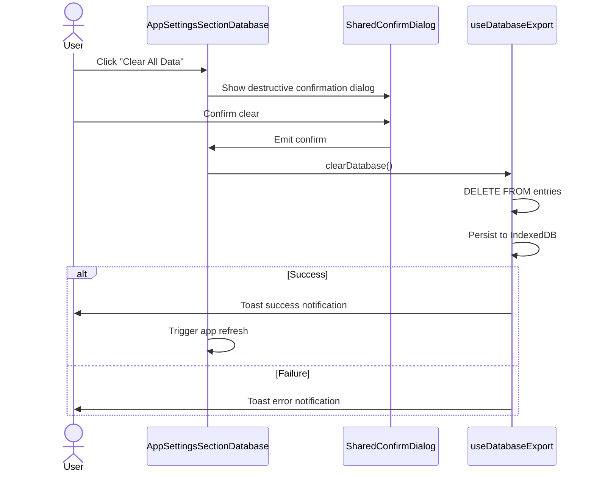

# Design Document — App Settings

## Overview

**Purpose**: This feature delivers settings management capabilities (theme preference, app version display, database export/import/clear) to the individual user of the journaling PWA.

**Impact**: Introduces a new `/settings` route and `app-settings` module. Adapts two existing shared composables (`useTheme`, `useDatabaseExport`) and adds a reusable `SharedConfirmDialog` component. Adds a settings access point to the day navigation area.

### Goals

- Provide theme toggle (light/dark) with system preference detection and localStorage persistence
- Display app version from `package.json` via Vite build-time injection
- Enable database backup via timestamped file export
- Enable database restore via validated file import with confirmation
- Enable database clear with destructive-action confirmation
- Provide accessible, responsive settings interface consistent with the app's calm aesthetic

### Non-Goals

- User accounts or authentication settings
- Cloud sync or remote backup configuration
- Data-level settings (entry display preferences, sort order)
- Notification or PWA installation management settings

## Architecture

> Discovery findings documented in `research.md`. Key insight: `useTheme` and `useDatabaseExport` composables already exist but `useDatabaseExport` references incorrect table names and filename patterns from a prior project.

### Existing Architecture Analysis

- **Current pattern**: Feature modules in `src/modules/`, thin page wrappers in `src/pages/`, shared composables in `src/shared/composables/`
- **No global navigation**: `App.vue` renders `<RouterView />` only; each page manages its own layout
- **Router**: Active routes for home redirect and entry-day-view; a settings route constant exists (`ROUTES.SETTINGS = '/settings'`) but is commented out
- **Composables**: `useTheme` (singleton, localStorage + system detection), `useDatabaseExport` (needs domain adaptation), `useToast` (singleton notifications)
- **Base components**: `BaseDialog`, `BaseButton`, `BaseSwitch`, `BaseSpinner`, `BaseToast` — all available

### Architecture Pattern & Boundary Map



**Architecture Integration**:

- Selected pattern: Feature module (`app-settings`) with thin page wrapper, matching `entry-day-view` pattern
- Domain boundaries: Settings module is isolated; accesses shared composables only through established interfaces
- Existing patterns preserved: Root/Section/UI component hierarchy, composable singleton pattern, thin page wrapper
- New components: `SharedConfirmDialog` (reusable confirmation dialog), settings module components
- Steering compliance: Three-tier component hierarchy, CSS variable usage, keyboard accessibility, responsive design

### Technology Stack

| Layer    | Choice / Version  | Role in Feature                               | Notes                             |
| -------- | ----------------- | --------------------------------------------- | --------------------------------- |
| Frontend | Vue 3, Reka UI    | Settings page components, dialog, switch      | Existing stack, no additions      |
| Data     | sql.js, IndexedDB | Database export/import/clear operations       | Via existing `useDatabase`        |
| Storage  | localStorage      | Theme preference persistence                  | Via existing `useTheme`           |
| Build    | Vite              | `__APP_VERSION__` injection from package.json | Already configured in vite.config |

No new dependencies required.

## System Flows

### Database Import Flow



### Database Clear Flow



## Requirements Traceability

| Requirement | Summary                | Components                                                         | Interfaces          | Flows           |
| ----------- | ---------------------- | ------------------------------------------------------------------ | ------------------- | --------------- |
| 1.1–1.4     | App version display    | AppSettingsSectionAppearance                                       | `__APP_VERSION__`   | —               |
| 2.1–2.8     | Theme management       | AppSettingsSectionAppearance, useTheme                             | `useTheme` contract | —               |
| 3.1–3.8     | Database export        | AppSettingsSectionDatabase, useDatabaseExport                      | `useDatabaseExport` | —               |
| 4.1–4.14    | Database import        | AppSettingsSectionDatabase, SharedConfirmDialog, useDatabaseExport | `useDatabaseExport` | Database Import |
| 5.1–5.10    | Database clear         | AppSettingsSectionDatabase, SharedConfirmDialog, useDatabaseExport | `useDatabaseExport` | Database Clear  |
| 6.1–6.5     | Settings access        | EntryDayViewSectionNavigation, SettingsPage, AppSettingsRoot       | Router, link        | —               |
| 7.1–7.7     | State & error handling | AppSettingsRoot, useDatabaseExport, useToast                       | `useToast` contract | —               |
| 8.1–8.5     | Responsive design      | All app-settings components                                        | CSS variables       | —               |
| 9.1–9.6     | Accessibility          | All components, SharedConfirmDialog                                | ARIA attributes     | —               |

## Components and Interfaces

| Component                      | Domain | Intent                         | Req Coverage                | Key Dependencies          | Contracts |
| ------------------------------ | ------ | ------------------------------ | --------------------------- | ------------------------- | --------- |
| SettingsPage                   | Pages  | Thin route wrapper             | 6.1–6.5                     | AppSettingsRoot (P0)      | —         |
| AppSettingsRoot                | Module | Orchestrate settings sections  | 6.1–6.5, 7.1–7.7            | useToast (P1)             | State     |
| AppSettingsSectionAppearance   | Module | Theme toggle + version display | 1.1–1.4, 2.1–2.8            | useTheme (P0), BaseSwitch | State     |
| AppSettingsSectionDatabase     | Module | Database operations UI         | 3.1–3.8, 4.1–4.14, 5.1–5.10 | useDatabaseExport (P0)    | State     |
| SharedConfirmDialog            | Shared | Reusable confirmation modal    | 4.3, 5.1–5.2, 9.6           | BaseDialog (P0)           | Service   |
| useDatabaseExport (adaptation) | Shared | Export/import/clear composable | 3.1–3.8, 4.1–4.14, 5.1–5.10 | useDatabase (P0)          | Service   |

### Pages

#### SettingsPage

| Field        | Detail                                                               |
| ------------ | -------------------------------------------------------------------- |
| Intent       | Thin route entry point for `/settings`, delegates to AppSettingsRoot |
| Requirements | 6.1, 6.2, 6.3                                                        |

**Summary-only**: Follows the established thin-page pattern. Extracts no route params. Includes `<BaseToast />` for notifications. Maximum ~30 lines.

### App Settings Module

#### AppSettingsRoot

| Field        | Detail                                               |
| ------------ | ---------------------------------------------------- |
| Intent       | Orchestrate settings sections: appearance + database |
| Requirements | 6.1, 6.2, 6.4, 6.5, 7.1–7.7                          |

**Responsibilities & Constraints**

- Render all settings sections in a vertical layout with a back-navigation link
- Provide page title ("Settings") and back link to the previous page or entry day view
- No direct data fetching — sections manage their own state via composables

**Dependencies**

- Inbound: SettingsPage — renders this component (P0)
- Outbound: AppSettingsSectionAppearance, AppSettingsSectionDatabase — child sections (P0)

**Contracts**: State [x]

##### State Management

- State model: No local state; delegates to child sections
- Back navigation: `router.back()` or fallback to entry day view route

**Integration & Constraints**

- Must honor 200-line root component limit
- Keyboard accessible: focus management on mount
- Responsive: centered content area (max-width ~800px) on desktop, full-width on mobile

#### AppSettingsSectionAppearance

| Field        | Detail                                                     |
| ------------ | ---------------------------------------------------------- |
| Intent       | Display theme toggle and app version                       |
| Requirements | 1.1, 1.2, 1.3, 1.4, 2.1, 2.2, 2.3, 2.4, 2.5, 2.6, 2.7, 2.8 |

**Responsibilities & Constraints**

- Display current theme state via `BaseSwitch`
- Toggle between light and dark via `useTheme().toggleTheme()`
- Display app version from `__APP_VERSION__` constant
- Theme toggle indicates current state: switch "on" = dark mode

**Dependencies**

- Outbound: useTheme — theme state and toggle (P0)
- Outbound: BaseSwitch — toggle UI control (P0)

**Contracts**: State [x]

##### State Management

- State model: `theme` ref from `useTheme` singleton; `__APP_VERSION__` build constant
- No persistence needed — `useTheme` handles localStorage internally

**Integration & Constraints**

- `BaseSwitch` `modelValue` bound to `theme === 'dark'`
- ARIA label: "Toggle dark mode"
- Version displayed as static text, no interaction
- Theme changes apply immediately (no save button)

#### AppSettingsSectionDatabase

| Field        | Detail                                                           |
| ------------ | ---------------------------------------------------------------- |
| Intent       | Database export, import, and clear operations with confirmations |
| Requirements | 3.1–3.8, 4.1–4.14, 5.1–5.10, 7.1–7.4, 8.1–8.4, 9.1–9.5           |

**Responsibilities & Constraints**

- Export button: triggers `exportDatabase()`, shows loading state
- Import button: opens hidden file input, shows confirmation dialog, triggers `importDatabase(file)`
- Clear button: shows destructive confirmation dialog, triggers `clearDatabase()`
- Disables all database operation buttons when any operation is in progress
- Triggers app refresh after successful import or clear

**Dependencies**

- Outbound: useDatabaseExport — database operations (P0)
- Outbound: SharedConfirmDialog — import and clear confirmations (P0)
- Outbound: BaseButton — operation triggers (P1)

**Contracts**: State [x]

##### State Management

- State model: `isExporting`, `isImporting`, `isClearing` from `useDatabaseExport`
- Local state: `showImportDialog`, `showClearDialog`, `pendingImportFile` for dialog management
- Computed: `isAnyOperationInProgress` to disable all buttons during any operation

**Integration & Constraints**

- Hidden `<input type="file" accept=".db,.sqlite,.sqlite3">` for file selection
- After successful import/clear: reload app state (e.g., `window.location.reload()` or re-initialize database)
- Export button: secondary variant; Import button: secondary variant; Clear button: danger variant
- All buttons show loading text during operations
- Loading and disabled states communicated to screen readers via button props

### Shared Components

#### SharedConfirmDialog

| Field        | Detail                                               |
| ------------ | ---------------------------------------------------- |
| Intent       | Reusable confirmation dialog for destructive actions |
| Requirements | 4.3, 5.1, 5.2, 9.6                                   |

**Responsibilities & Constraints**

- Wrap `BaseDialog` with confirm/cancel button pair
- Support `variant: 'default' | 'danger'` for destructive styling
- Emit `confirm` and `cancel` events
- Focus trap and Escape key dismissal (inherited from Reka UI Dialog)

**Dependencies**

- Outbound: BaseDialog — modal infrastructure (P0)
- Outbound: BaseButton — confirm and cancel buttons (P1)

**Contracts**: Service [x]

##### Service Interface

```typescript
interface SharedConfirmDialogProps {
  /** Whether the dialog is open */
  open: boolean
  /** Dialog title */
  title: string
  /** Dialog description/warning text */
  description: string
  /** Confirm button label */
  confirmLabel: string
  /** Cancel button label (defaults to "Cancel") */
  cancelLabel?: string
  /** Visual variant for destructive actions */
  variant?: 'default' | 'danger'
  /** Whether the confirm action is in progress */
  loading?: boolean
}

interface SharedConfirmDialogEmits {
  /** User confirmed the action */
  confirm: []
  /** User cancelled the action */
  cancel: []
  /** Dialog open state changed */
  'update:open': [value: boolean]
}
```

- Preconditions: `title` and `description` must be provided
- Postconditions: Either `confirm` or `cancel` is emitted when dialog closes via user action
- Invariants: Focus is trapped within dialog while open; Escape key dismisses (emits `cancel`)

**Integration & Constraints**

- Confirm button uses `variant="danger"` when dialog `variant` is `'danger'`
- Cancel button always uses `variant="secondary"` or `variant="ghost"`
- Dialog description should clearly communicate consequences for destructive actions
- Tab order: Cancel → Confirm (non-destructive focus first)

### Shared Composables (Adaptation)

#### useDatabaseExport (adaptation)

| Field        | Detail                                              |
| ------------ | --------------------------------------------------- |
| Intent       | Fix domain references for this project's data model |
| Requirements | 3.1–3.8, 4.1–4.14, 5.1–5.10                         |

**Responsibilities & Constraints**

- Update export filename pattern: `mizukara-YYYY-MM-DD-HHMM.db`
- Update `validateSqliteData`: check for `entries` table instead of `kanjis`
- Update `clearDatabase`: `DELETE FROM entries` only (single table)
- Preserve existing interface contract (`UseDatabaseExport`)

**Dependencies**

- Outbound: useDatabase — database access singleton (P0)
- Outbound: useToast — notification display (P1)

**Contracts**: Service [x]

##### Service Interface

```typescript
interface UseDatabaseExport {
  isExporting: Ref<boolean>
  isImporting: Ref<boolean>
  isClearing: Ref<boolean>
  exportDatabase: () => void
  importDatabase: (file: File) => Promise<boolean>
  validateDatabaseFile: (file: File) => Promise<boolean>
  clearDatabase: () => Promise<void>
}
```

- Preconditions: Database must be initialized before operations
- Postconditions: Export triggers file download; Import replaces in-memory DB and persists to IndexedDB; Clear removes all entries and persists
- Invariants: Only one operation active at a time (enforced by loading flags); existing database preserved on import validation failure

**Integration & Constraints**

- Export filename: `mizukara-YYYY-MM-DD-HHMM.db` with local timezone, zero-padded values
- Validation: open imported file with sql.js, check `sqlite_master` for `entries` table
- Clear: single `DELETE FROM entries` statement, then persist
- Error handling: all errors caught and displayed via `useToast.error()`
- Success: all successes displayed via `useToast.success()`

### Entry Day View (Modification)

#### EntryDayViewSectionNavigation (addition)

| Field        | Detail                                                   |
| ------------ | -------------------------------------------------------- |
| Intent       | Add settings access icon/link to existing navigation bar |
| Requirements | 6.1, 6.3                                                 |

**Summary-only**: Add a settings icon button (gear icon) to the existing navigation section. Links to `/settings` route via `<RouterLink>`. Minimal change to existing component — one additional element in the navigation bar. ARIA label: "Settings". 44x44px touch target.

## Data Models

No new database tables or schema changes required. This feature operates on the existing `entries` table.

### Domain Model

- **Settings preferences** (theme): Stored in localStorage, not in the database
- **App version**: Build-time constant from `package.json`, no storage
- **Database operations**: Operate on the existing entries database as a whole (export/import/clear)

### Physical Data Model

**Existing schema**: `/src/db/migrations/001-create-entries.sql`

Database operations in this feature work at the whole-database level:

- **Export**: Serializes the entire sql.js database to a binary `.db` file
- **Import**: Replaces the entire in-memory database from an imported binary file, then runs migrations
- **Clear**: Deletes all rows from the `entries` table
- **Validation**: Verifies imported binary contains a valid SQLite database with an `entries` table

No migration changes needed.

---

_Created: 2026-02-15_
_Feature: app-settings_
_Status: Design generated_
