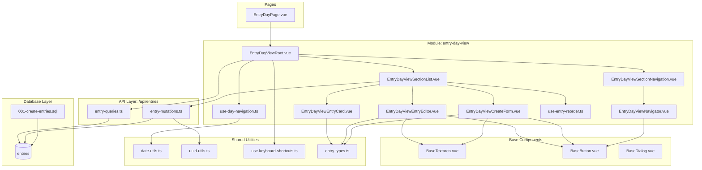
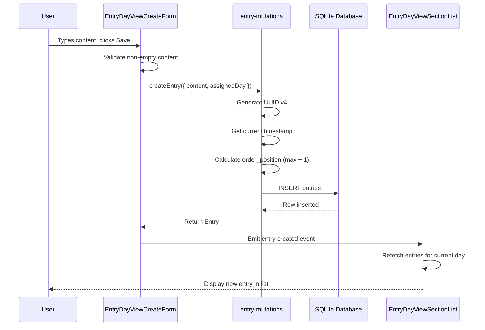
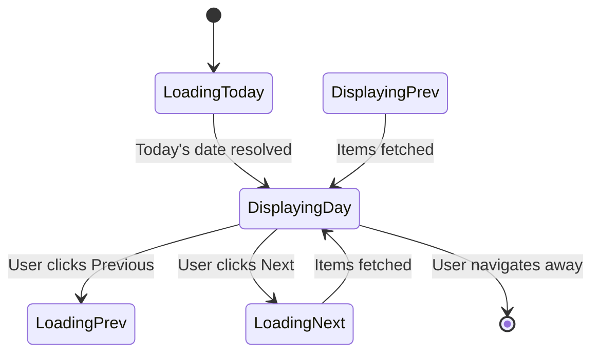
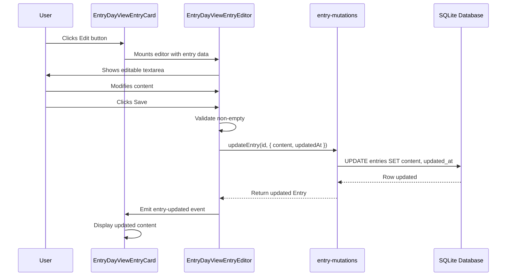

# Design: Architecture & System Flows

**Part of**: [journal-core-mvp design](design.md)  
**Theme**: Architecture patterns, technology stack, system flows

**Related files**:

- [design.md](design.md) — Overview and navigation
- [design-components.md](design-components.md) — Component specifications
- [design-data.md](design-data.md) — Data models and schema

---

## Existing Architecture Analysis

The codebase contains substantial infrastructure copied from a sibling kanji dictionary app:

**Database Layer** (`/src/db/`):

- SQLite via sql.js with IndexedDB persistence fully operational
- Migration framework in place, ready for new table definitions
- Auto-persist strategy handles Android PWA session kills

**API Layer** (`/src/api/`):

- `BaseRepository<T>` abstract class with query result mapping helpers
- Repository pattern established for all database access
- Type-safe interfaces defined in `types.ts`

**Base UI** (`/src/base/components/`):

- Full set of form primitives: `BaseTextarea`, `BaseButton`, `BaseInput`, `BaseDialog`
- All components support vee-validate integration and design tokens
- Keyboard accessibility built-in

**Constraints**:

- File size limits enforced via ESLint (Root 200, Section 250, UI 200, Composable 200)
- No Pinia/Vuex — state management via composables + SQLite as source of truth
- Modules must not import from each other — shared code goes in `/src/shared/`

---

## Architecture Pattern & Boundary Map

**Selected Pattern**: Modular Domain with Page-Module Coupling

**Architecture Integration**:

- **Selected Pattern**: Modular domain with clean page-module separation following user preference
- **Domain Boundaries**:
  - `/src/modules/entry-day-view/` owns day view, navigation, list display, entry editing
  - `/src/api/entries/` owns all database access (queries/mutations split)
  - `/src/shared/` owns cross-feature utilities (date, UUID, keyboard, types)
- **Existing Patterns Preserved**:
  - Repository pattern (all SQL in API layer)
  - Three-tier component hierarchy (Root/Section/UI)
  - Base vs Shared separation (generic vs app-specific)
  - Colocated tests for all new files
- **New Components Rationale**:
  - Single module for day view aligns with one-module-per-page principle
  - Two section components separate navigation from list concerns (file size management)
  - Split queries/mutations prevents file size violations
  - Shared utilities (date, UUID) support future modules
- **Steering Compliance**:
  - Follows structure.md module organization patterns
  - Respects database.md sync-ready schema requirements (UUIDs, timestamps, soft deletes)
  - Aligns with product.md "personal tool" philosophy (offline-first, no auth)

---

## Technology Stack

| Layer         | Choice / Version                | Role in Feature                        | Notes                                                 |
| ------------- | ------------------------------- | -------------------------------------- | ----------------------------------------------------- |
| Frontend      | Vue 3.4+ (Composition API)      | All UI components and state management | Existing — no changes                                 |
| UI Components | Reka UI + Base Components       | Headless primitives for accessible UI  | Existing — reuse BaseTextarea, BaseButton, BaseDialog |
| Data          | SQLite via sql.js (WebAssembly) | Local persistence of entries           | Existing — add migration only                         |
| Persistence   | IndexedDB                       | Long-term storage between sessions     | Existing — no changes                                 |
| Validation    | vee-validate 4+ + zod 3+        | Form validation and schema-based types | Existing — define entry schema                        |
| Routing       | vue-router 4+                   | Day view route with date parameter     | Existing — add `/records/:date?` route                |
| Runtime       | Browser (PWA)                   | Offline-first execution                | Existing — no changes                                 |

**New Dependencies**: None — all requirements satisfied by existing stack

**Technology Alignment**:

- Browser-native APIs chosen where possible (Date, crypto.randomUUID) to minimize bundle size
- HTML5 `<input type="date">` for MVP date picker (native UX, cross-platform)
- No drag-and-drop library for MVP (up/down buttons instead)
- All design decisions prioritize offline-first and personal tool philosophy

---

## System Flows

### Entry Creation Flow

**Key Decisions**:

- Creation happens inline in day view (no modal), default to currently viewed day
- UUID generation uses `crypto.randomUUID()` (no library needed)
- Validation only checks non-empty content (length agnostic)
- Initial order_position set to max(existing positions) + 1, or 0 for first entry
- Immediate refetch ensures UI consistency

---

### Day Navigation Flow

**Key Decisions**:

- Route parameter `/entries/:date?` stores currently viewed day
- Missing date parameter defaults to today
- Navigation updates route (enables browser back/forward)
- Keyboard shortcuts (j/k or arrow keys) trigger same navigation logic

---

### Entry Editing Flow (Inline)

**Key Decisions**:

- Edit mode replaces card view inline (no modal)
- Explicit "Edit" button prevents accidental mutations
- "Cancel" button reverts changes without save
- Unsaved changes warning on navigation (beforeunload)

---

## Responsive Design Strategy

**Breakpoints**:

- Mobile: 320-767px
- Tablet: 768-1023px
- Desktop: 1024px+

**Mobile Optimizations**:

- Full-width entry cards with larger tap targets (44x44px minimum)
- Single-column layout for list view
- Larger font sizes for content display (--font-size-md minimum)
- Touch-friendly navigation buttons (prev/next day)
- Reorder mode shows buttons (no drag-and-drop on mobile)

**Desktop Optimizations**:

- Two-column layout option (navigator + list) if space allows
- Hover states for edit/delete buttons
- Keyboard shortcuts enabled
- Optional: Drag-and-drop in reorder mode (post-MVP)

**CSS Approach**:

- Mobile-first design (base styles optimized for small screens)
- Progressive enhancement for larger screens
- CSS media queries for breakpoint-specific adjustments
- Design tokens for consistent spacing/sizing

---

_Part of journal-core-mvp design • See [design.md](design.md) for navigation_
